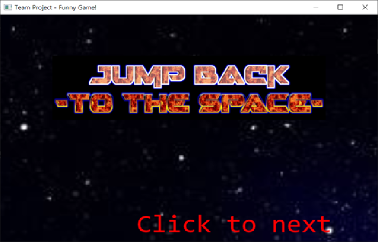
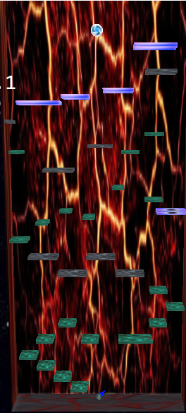

# Computer-Graphics-Team-Project (Backup)
## 맡은 역할
- 물리엔진 전부  ( 충돌, 중력, 마찰력, etc ... )
- 공, 벽, 발판 구축
- 게임 스테이지 설계
## 제목
- Jump Back To The Space

## 게임 목표
- 맵 내에서 공을 튀겨서 목표 지점까지 올라가는 것이 목표
## 맵 구조 및 구조물 설명
- 전체 구조
  * 우주 & 지옥 컨셉으로 잡았습니다.

- 발판 설명
  - Sticky Plate: 끈적끈적한 발판, 공이 착 달라붙는다.
  
  
  - Iron Plate: 딴딴한 발판, 공이 어느정도 튄다.
  
  
  - Whitehole Plate: 점프 바닥, 공이 높게 튄다.
  
  
  - Ice Plate: 미끌미끌한 바닥, 공이 살짝 미끄러진다.
  

- 골인 지점
  - 시공의 폭풍 속으로~  
  
  
## 팀 전체 구현 내용
- 공 및 발판, 벽 등 fundamental structure 구축
- 인트로 & 아웃트로 & 엔딩크레딧
- 물리 엔진(physics.h)
  * 공과 벽과의 충돌
  * 중력
  * 마찰력
- 소리 및 글자 렌더링
- 3D 스카이박스, 텍스쳐
- 2D 애니메이션, 역동적인 카메라워크
- 파티클 구현
  
